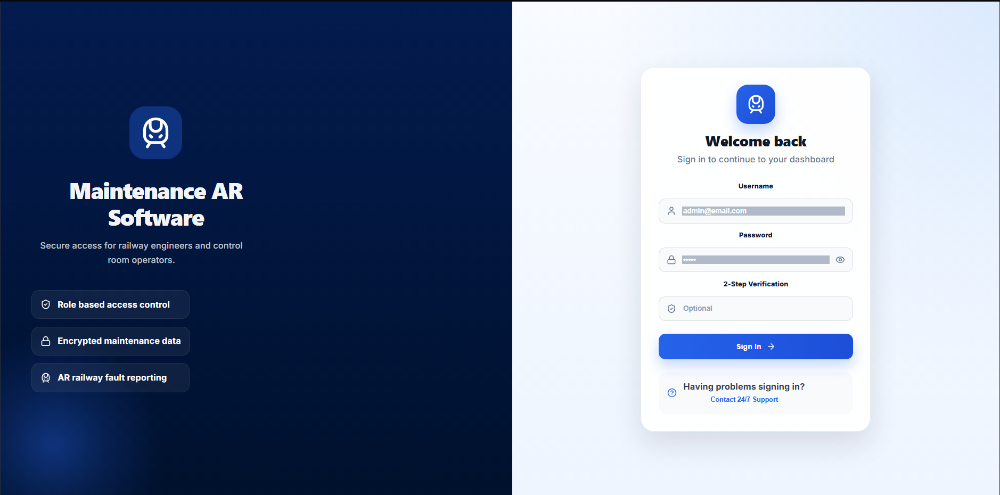
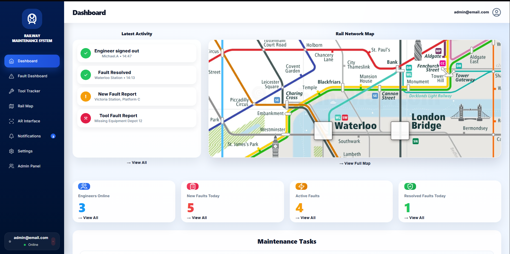
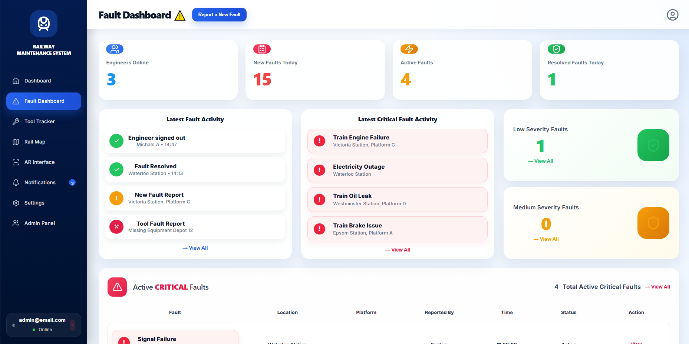
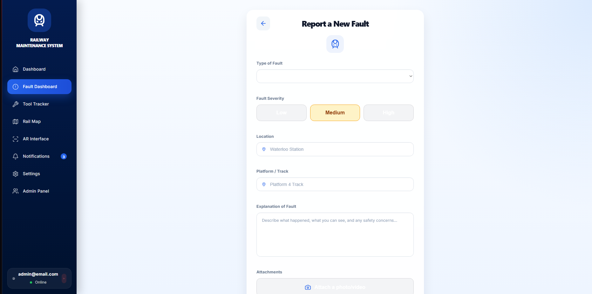
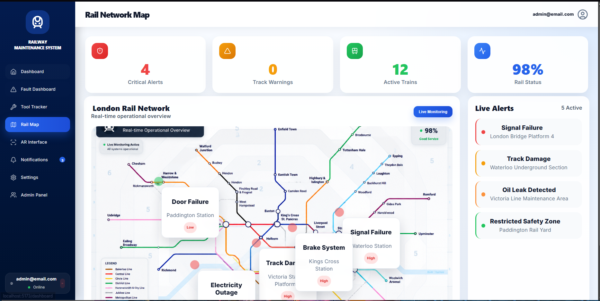
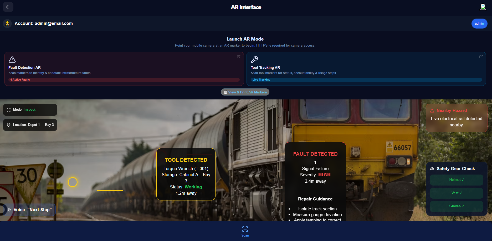
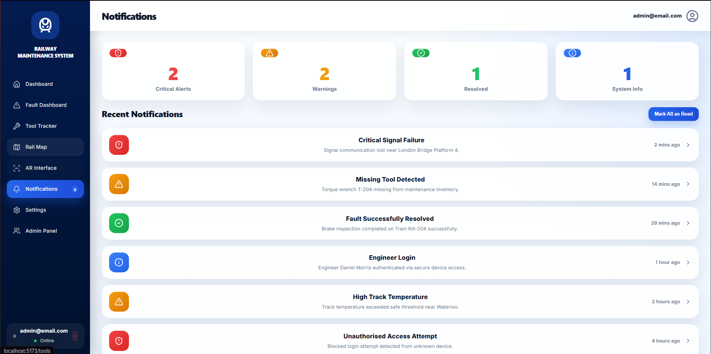
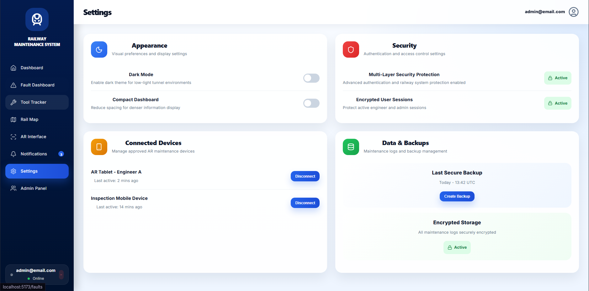
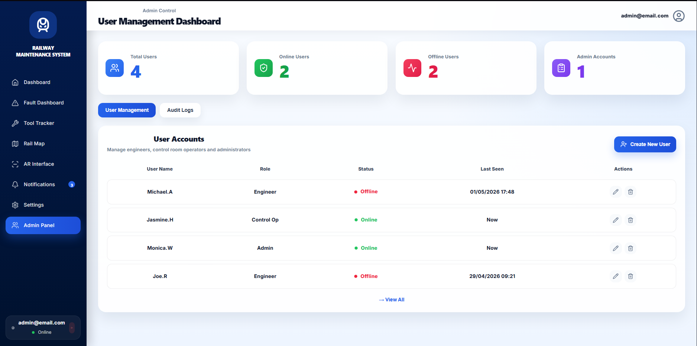
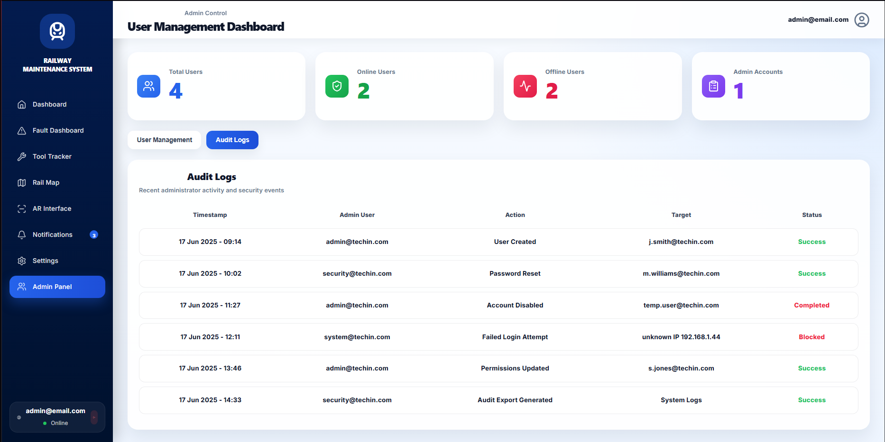

# 🚆 Smart Rail Maintenance Platform

A full-stack railway maintenance management platform featuring **real-time fault reporting, asset tracking, role-based administration, and browser-based Augmented Reality (AR)** to assist railway engineers during maintenance operations.

Originally developed as part of a university software engineering group project, I later independently expanded and refined the application into a more complete portfolio project by redesigning the frontend, improving the user experience, extending functionality, auditing the backend implementation, and integrating additional features.

---

## 📹 Project Demonstration

https://github.com/user-attachments/assets/d5157316-0e4a-4d7a-b1a2-adf631148c6a

---

# 📖 Overview

The Smart Rail Maintenance Platform was designed to improve how railway engineers and control room operators manage maintenance activities across a rail network.

The application enables authorised users to:

- Report infrastructure faults
- Monitor active maintenance issues
- Track engineering equipment
- Visualise railway incidents on an interactive network map
- Use browser-based Augmented Reality for maintenance assistance
- Manage users through an administrative portal
- Receive live operational notifications

The application has been designed to operate on both **desktop and mobile devices**, providing engineers with a responsive interface both in the control room and on-site.

---

# ✨ Features

## 🔐 Authentication

- Secure login system
- JWT authentication
- Role-based access control
- Protected routes

---

## 📊 Dashboard

The dashboard provides an operational overview including:

- Engineer activity
- Fault statistics
- Recent maintenance events
- Rail network overview
- Daily maintenance summaries

---

## 🚨 Fault Management

Engineers can:

- Report new faults
- Assign severity levels
- Record locations
- Upload supporting information
- Track repair progress

Control room operators can monitor:

- Critical faults
- Active incidents
- Resolved maintenance
- Fault history

---

## 🛠 Tool Tracking

Maintenance equipment can be tracked throughout the railway network.

Features include:

- Equipment availability
- Missing tool detection
- Storage locations
- Scan history
- Inventory summaries

---

## 🗺 Rail Network Map

Interactive mapping provides:

- Live railway overview
- Critical infrastructure alerts
- Active maintenance locations
- Fault visualisation
- Network status monitoring

---

## 🥽 Augmented Reality

The application includes browser-based AR functionality built using **AR.js** and **A-Frame**.

Engineers can use AR markers to display:

### Fault Detection

- Fault information
- Severity
- Safety warnings
- Repair guidance

### Tool Tracking

- Equipment identification
- Storage location
- Tool status
- Maintenance information

---

## 🔔 Notifications

Centralised notifications display:

- Critical alerts
- Maintenance warnings
- Security events
- Engineer activity
- System updates

---

## 👥 Administration

Administrators can:

- Manage users
- View audit logs
- Monitor account activity
- Configure system settings
- Manage connected devices

---

# 📱 Responsive Design

The application was designed to function across multiple screen sizes.

Supported devices include:

- Desktop
- Laptop
- Tablet
- Mobile

---

# 🏗 Technology Stack

## Frontend

- React
- Vite
- Tailwind CSS
- React Router
- Axios
- AR.js
- A-Frame

## Backend

- ASP.NET Core Web API
- Entity Framework Core
- JWT Authentication
- REST API

## Database

- Microsoft SQL Server

## Development Tools

- Visual Studio 2022
- Visual Studio Code
- Git
- GitHub
- Postman

---

# 🏛 System Architecture

```
Users
      │
      ▼
React Frontend
      │
REST API
      │
ASP.NET Core Backend
      │
Entity Framework Core
      │
SQL Server Database
```

---

# 📸 Screenshots

## Login



## Dashboard



## Fault Dashboard



## Report Fault



## Tool Tracker


## Rail Network Map



## AR Interface



## Notifications



## Settings



## Administration




---

# 👨‍💻 My Contribution

This project was originally developed by a team of four students for a university software engineering assignment.

## Primary Responsibilities

During the original project I was responsible for:

- Designing and developing the complete React frontend
- Building the user interface
- Implementing responsive layouts
- Creating navigation and page structure
- Developing reusable React components
- Integrating frontend functionality with backend APIs

## Portfolio Improvements

After the university submission, I independently continued developing the project to improve both functionality and code quality.

Improvements included:

- Complete frontend redesign
- Improved mobile responsiveness
- Enhanced user experience
- Additional dashboard features
- Expanded AR functionality
- Improved role-based interfaces
- Backend code review and auditing
- API improvements
- UI consistency updates
- Performance optimisations
- Additional administration features
- General bug fixes and refinements

This repository reflects the enhanced portfolio version rather than the original university submission.

---

# 🚀 Running the Project

## Frontend

```bash
npm install
npm run dev
```

## Backend

```bash
dotnet restore
dotnet run
```

Configure the SQL Server connection string within the backend project before launching the API.

---

# 🎯 Future Improvements

Potential future enhancements include:

- SignalR live updates
- AI-assisted fault detection
- Cloud deployment (Azure)
- Docker support
- CI/CD pipeline
- Automated testing
- QR asset management
- GPS engineer tracking
- Offline engineer mode

---

# 📚 What I Learned

This project strengthened my experience in:

- Full-stack web development
- React application architecture
- Responsive UI design
- REST API integration
- Authentication and authorisation
- SQL database interaction
- Browser-based Augmented Reality
- Software architecture
- Collaborative software development
- Maintaining and improving an existing codebase

---

# 📄 License

This project is provided for educational and portfolio purposes.

---

## 👤 Author

Diogo Duarte Dias

GitHub: https://github.com/Baamzzz

LinkedIn: https://linkedin.com/in/yourprofile
